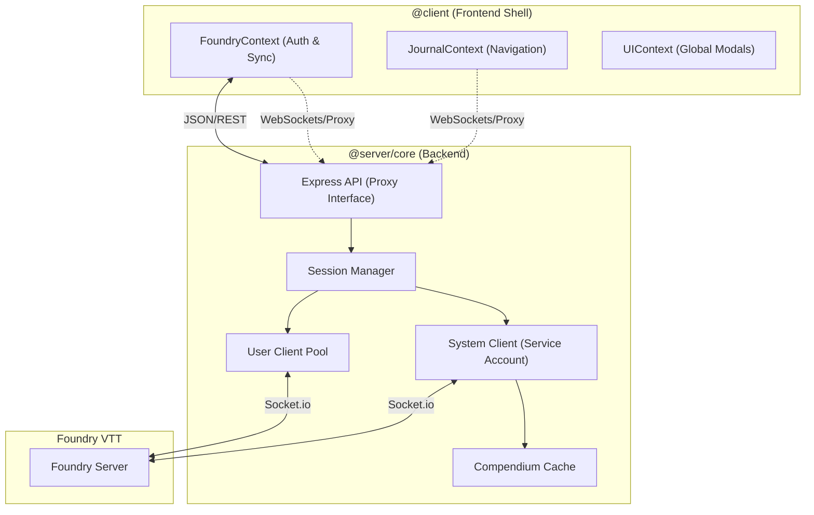

# SheetDelver System Architecture

This document serves as the authoritative source of truth for the SheetDelver architecture. It describes the design principles, structural organization, and decoupled "Core/Shell" model.

## 1. Architectural Philosophy
SheetDelver is designed as a **Headless Client Proxy** for Foundry VTT. It follows a "Clean Architecture" approach, strictly separating business logic from delivery mechanisms.

### Core Principles
- **Dual-Socket Model**: The backend maintains a permanent **System Client** for global world monitoring and a transient **User Client** pool for individual player sessions.
- **Frontend Agnosticism**: The Frontend (UI) never communicates with Foundry directly. It interacts solely with the SheetDelver API.
- **Context-Driven State**: The UI uses React Contexts as the single source of truth, synchronized via real-time WebSockets (Socket.io) to the Backend API.

---

## 2. Hardened Environment Model (4-Folder Root)

To ensure stability and prevent environment pollution (e.g., Node.js leaks in the browser), SheetDelver enforces a strict **Logic Firewall** via its directory structure:

- **`src/client` (`@client`)**: Pure frontend code. Contains UI components, React hooks, and browser-safe services. Strictly forbidden from importing Node.js globals (`fs`, `path`, `process`).
- **`src/server` (`@server`, `@core`)**: Pure backend code. Contains the Express API, Session Manager, and direct Foundry socket implementations.
- **`src/shared` (`@shared`)**: Environment-agnostic logic. Contains interfaces, constants, and pure utilities (math, string parsing) safe for both environments.
- **`src/modules` (`@modules`)**: Pluggable system adapters. Each module carries its own internal firewall (`src/server` vs `src/ui`).

---

## 3. Decoupled Core/Shell Model

### 3.1 The Core Description (Server-Only)
- **Session Manager (`@core/session`)**:
    - Manages the lifecycle of user sessions and maps API Tokens to `ClientSocket` instances.
    - Maintains the **System Client** (`CoreSocket`) for unauthenticated status checks and world monitoring.
- **Foundry Sockets (`@core/foundry/sockets`)**:
    - **CoreSocket**: A singleton connection acting as a service account. Tracks player lists, world status, and system metadata.
    - **ClientSocket**: A per-user connection. Receives personal notifications (Item sharing, whispered chat) and performs user-authorized writes.
- **Compendium Cache**: A centralized service that pre-processes and caches compendium indices for rapid name resolution and data retrieval.

### 3.2 The Delivery Layers
- **Server (`src/server`)**:
    - **Status Handler**: Aggregates data from both the System Client and the specific User Client to provide a complete view of the world state.
    - **Smart Proxy Socket**: Multiplexes individual Foundry connections to the frontend via a unified Socket.io interface.
    - **Module Routing**:
        - **API**: RegEx-based routing allows system-specific packages to mount their own API logic dynamically.
        - **UI**: The core actor page delegates rendering to the module's registered `ActorPage`, ensuring full UI autonomy.
    - **Shared Content**: Tracks shared media (images/journals) targeted at the current user.

---

## 4. Frontend Architecture

### 4.1 React Contexts
- **FoundryProvider**: The heart of the application. Manages the connection step (`init` -> `login` -> `dashboard`), authenticates users, and polls for real-time state updates (actors, users, system info).
- **JournalProvider**: Manages journal entry loading, folder hierarchies, and pagination logic.
- **UIProvider**: Manages the state of global overlays like the sidebars, floating HUD, and shared content modals.

---

## 5. Module System

SheetDelver's RPG system support is entirely module-driven. Modules live outside the core in `<DATA_DIR>/modules/` (managed installs) or `<DATA_DIR>/local/modules/` (local dev source). The data directory is resolved from `--data-dir=<path>` CLI argument or the `SHEET_DELVER_DATA` environment variable (defaults to `./data/`). Built-in fallback components (`GenericActorPage`, `GenericSheet`) live in `src/client/ui/`.

### 5.1 Module Operating Modes

**Mode A — Source Module (local dev):** `info.json` points to `.ts`/`.tsx` files. The platform runs them via `tsx` with full tsconfig alias resolution. Suitable for trusted, locally-installed modules.

**Mode B — Artifact Module (managed/remote):** `info.json` points to pre-compiled `dist/logic.js` and `dist/ui.js`. Bundles use only `@sheet-delver/sdk` — no internal aliases. Required for modules installed from remote sources.

The registry loader at `src/modules/registry/core/server.ts` uses Node's native `import()` and handles both modes transparently based on file extension.

### 5.2 Static Registry and Runtime Fallback

The client-side `getUIModule(systemId)` function (`src/modules/registry/core/client.ts`) loads module UI in three stages:

1. **Static registry** (`data/module-ui-registry.ts`): Auto-generated at startup by `ensureManagedConfigs()`. Contains one explicit `import()` per known module so webpack can statically bundle them as chunks.
2. **Runtime fallback** (`GET /api/modules/:id/ui`): For modules installed after the current build. The server rewrites bare imports to `window.__SD.*` globals and serves raw ESM. Webpack ignores this import via `/* webpackIgnore: true */`.
3. **Platform default**: Falls back to `GenericActorPage` / `GenericSheet` if all loaders fail.

### 5.3 Module Hot-Reload

When an admin switches a module's source or changes its lifecycle state, the server broadcasts one of three socket events (`moduleSourceChanged`, `moduleStateChanged`, `moduleRegistryChanged`). Both `FoundryContext` and `ActorPageRouter` listen for these and call `invalidateModuleSourceCache()` to clear cached manifests, triggering re-resolution of the active module UI without a page refresh.

### 5.4 SDK Contract

External modules consume the platform via `@sheet-delver/sdk` (`src/shared/sdk/`). The SDK provides:
- `BaseSystemAdapter` — default adapter implementation
- `ModuleContext` — scoped logger, persistent cache, compendium discovery (injected by the platform at initialization)
- `ModuleFoundryClient` — stable Foundry access surface (actor/item/effect CRUD, rolls, world items)
- `UIModuleManifest` — the export contract for `module/ui.tsx`
- Server handler types: `ModuleServerRequest`, `ModuleServerParams`, `ModuleRouteHandler`

See `src/modules/MODULE_MANIFEST.md` for the full module authoring reference.

---

## 6. Key Workflows

### 6.1 World Discovery & Status
1.  Frontend polls `/api/status`.
2.  Backend queries the `SystemClient` for world status and active user counts.
3.  If a valid `Authorization` header is present, the backend also checks the specific `UserClient`'s connection state.

### 6.2 Authentication & Handshake
1.  Frontend POST `/api/login`.
2.  Backend creates a new `ClientSocket`, performs the Foundry login handshake, and returns a token.
3.  `FoundryContext` transitions to `'authenticating'` until the next status poll confirms the specific socket session is ready.

### 6.3 Data Normalization & Computation
All data returned by the API passes through a **System Adapter**.
1.  **Normalization**: Converts raw Foundry data to a UI-friendly shape.
2.  **Computation**: The adapter's `computeActorData` method calculates derived stats (e.g., Shadowdark inventory slots, HP totals) before the UI receives the data.
3.  **Categorization**: Items are grouped (e.g., "Spells", "Weapons") via `categorizeItems`.

---

## 7. Security & Isolation
- **Per-User Sockets**: Every user has their own dedicated socket. Foundry's native permission model is enforced at the transport layer.
- **Local Admin Surface**: `/admin` is a separate app-admin control plane. Admin routes require localhost access, dedicated admin authentication, and CSRF protection for browser mutations.

## 8. Ports & Config
- **Frontend**: 3000
- **Backend (API)**: 3001
- **Foundry**: Configurable via `DATA_DIR/config/settings.yaml`
