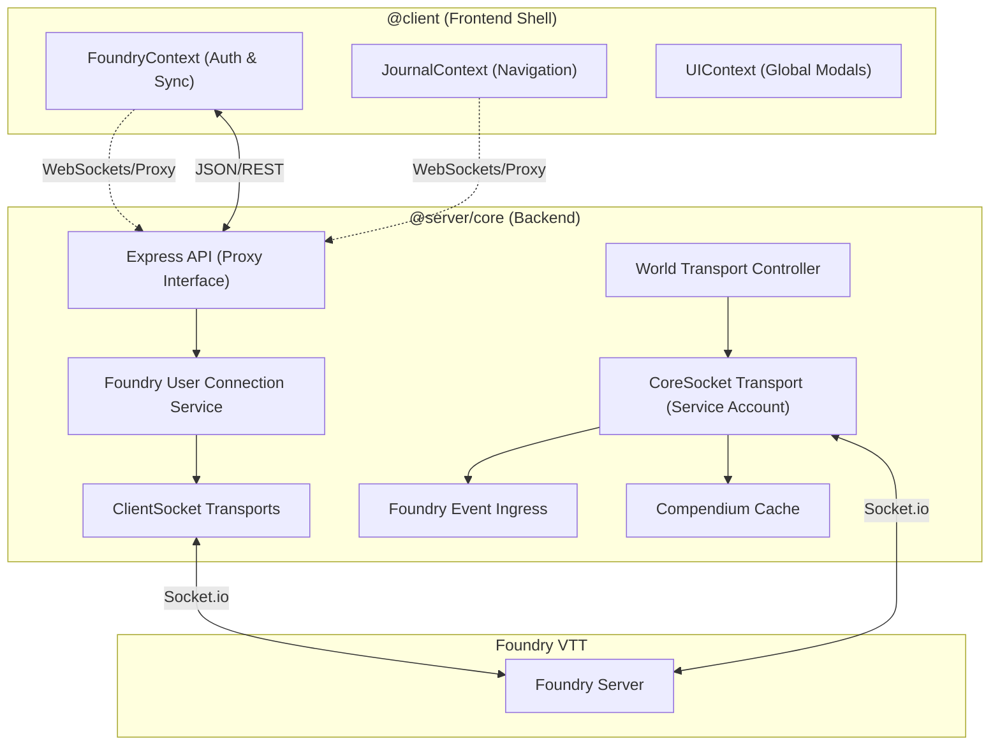

# SheetDelver System Architecture

This document serves as the authoritative source of truth for the SheetDelver architecture. It describes the design principles, structural organization, and decoupled "Core/Shell" model.

## 1. Architectural Philosophy
SheetDelver is designed as a **Headless Client Proxy** for Foundry VTT. It follows a "Clean Architecture" approach, strictly separating business logic from delivery mechanisms.

### Core Principles
- **Dual-Socket Model**: The backend maintains a permanent **System Client** for global world monitoring and a transient **User Client** pool for individual player sessions.
- **Frontend Agnosticism**: The Frontend (UI) never communicates with Foundry directly. It interacts solely with the SheetDelver API.
- **Context-Driven State**: The UI uses React Contexts as the single source of truth, synchronized via real-time WebSockets (Socket.io) to the Backend API.

---

## 2. Hardened Environment Model (4-Folder Root)

To ensure stability and prevent environment pollution (e.g., Node.js leaks in the browser), SheetDelver enforces a strict **Logic Firewall** via its directory structure:

- **`src/client` (`@client`)**: Pure frontend code. Contains UI components, React hooks, and browser-safe services. Strictly forbidden from importing Node.js globals (`fs`, `path`, `process`).
- **`src/server` (`@server`, `@core`)**: Pure backend code. Contains the Express API, service orchestration, server-owned Stores, and direct Foundry socket transports.
- **`src/shared` (`@shared`)**: Environment-agnostic logic. Contains interfaces, constants, and pure utilities (math, string parsing) safe for both environments.
- **`src/modules` (`@modules`)**: Module registry, lifecycle, distribution, and runtime loading infrastructure. Author-owned system modules live under the configured data directory, not in the source tree.

---

## 3. Decoupled Core/Shell Model

### 3.1 The Core Description (Server-Only)
- **Foundry User Connection Service (`src/server/services/foundry`)**:
    - Owns upstream Foundry user connection lifecycle and maps API tokens to `ClientSocket` transports.
    - Resolves Foundry user identity before creating a user transport; app-admin/backend sessions remain separate under `src/server/security`.
- **World Transport Controller (`src/server/services/world/WorldTransportController.ts`)**:
    - Owns service-account lifecycle policy: retry/backoff, heartbeat, browser engagement wakeups, world launch/shutdown, and lifecycle Store updates.
    - Commands `CoreSocket` as a transport; it does not live in `core/`.
- **Foundry Event Ingress (`src/server/services/world/FoundryEventIngress.ts`)**:
    - Subscribes to neutral Foundry socket events and applies application semantics such as document routing, user presence, shared-content updates, and runtime teardown.
- **Foundry Sockets (`@core/foundry/sockets`)**:
    - **CoreSocket**: A singleton service-account transport. Emits protocol facts and raw dispatch helpers; controller/ingress services own policy and Store mutation.
    - **ClientSocket**: A per-user transport. Receives neutral Foundry protocol events and performs user-authorized writes after identity is resolved by services.
- **Compendium Store / Discovery Shards**: Centralized services cache broad pack indices for name lookup and module-declared hydrated shards for compendium UUID document reads. Live Foundry pack-document fallback is diagnostic opt-in only.
- **Primary Document Cache**: Server-owned stores under `src/server/core/documents/primary/` that keep hydrated Foundry primary documents available after bootstrap. Actors are currently seeded through `ActorStore`; additional primary document types should join this area behind the same coordinator pattern.

### 3.2 The Delivery Layers
- **Server (`src/server`)**:
    - **Status Handler**: Aggregates data from both the System Client and the specific User Client to provide a complete view of the world state.
    - **Smart Proxy Socket**: Multiplexes individual Foundry connections to the frontend via a unified Socket.io interface.
    - **Module Routing**:
        - **API**: RegEx-based routing allows system-specific packages to mount their own API logic dynamically.
        - **UI**: The core actor page delegates rendering to the module's registered `ActorPage`, ensuring full UI autonomy.
    - **Shared Content**: Tracks shared media (images/journals) targeted at the current user.

### 3.3 World-Ready Bootstrap Gates

`SystemService.bootstrap()` blocks world readiness on the data the platform needs before serving user workflows:

1. Module discovery and compendium hydration from each module's `info.json`.
2. Primary document seeding through `PrimaryDocumentCacheCoordinator.seedAll()`.
3. Active module adapter initialization.

Per ADR-0022 and ADR-0023, `SystemService` lives at `src/server/services/world/SystemService.ts` (relocated from `core/system/`) so the orchestration facade sits alongside `WorldBootstrapper`, `WorldTransportController`, `FoundryEventIngress`, and `EngagementService`. `core/` never imports `services/`.

For actors, the platform performs one system-client fetch during bootstrap, seeds `ActorStore`, and then keeps that store in parity through Foundry event ingress (`modifyDocument` results and broadcasts). Actor API reads and dashboard card projections should read from this platform cache; they should not repeatedly ask Foundry to rehydrate the same actor list.

---

## 4. Frontend Architecture

### 4.1 React Contexts
- **FoundryProvider**: The heart of the application. Manages the connection step (`init` -> `login` -> `dashboard`), authenticates users, and polls for real-time state updates (actors, users, system info).
- **JournalProvider**: Manages journal entry loading, folder hierarchies, and pagination logic.
- **UIProvider**: Manages the state of global overlays like the sidebars, floating HUD, and shared content modals.

---

## 5. Module System

SheetDelver's RPG system support is entirely module-driven. Modules live outside the core in `<DATA_DIR>/modules/` (managed installs) or `<DATA_DIR>/local/modules/` (local dev source). The data directory is resolved from `--data-dir=<path>` CLI argument or the `SHEET_DELVER_DATA` environment variable. Generic fallback components (`GenericActorPage`, `GenericSheet`) live in `src/client/ui/`.

### 5.1 Module Operating Modes

**Mode A — Source Module (local dev):** modules live under `<DATA_DIR>/local/modules/<id>`. Server logic is imported during development, and UI source is bundled through the generated `.managed/module-ui-registry.ts` before `next dev` / `next build`. Suitable for trusted local development.

**Mode B — Artifact Module (managed package):** modules live under `<DATA_DIR>/modules/<id>`. `info.json` points to pre-compiled `dist/logic.js`, `dist/ui.js`, and optional `dist/server.js`. Bundles use public SDK entry points only; no internal aliases. The current operating model supports owner-controlled packages already present in this directory; remote index and artifact retrieval remain disabled by ADR-0033.

The server registry resolves the active module source from lifecycle state and imports the matching adapter/route artifact. Local source and managed installs are intentionally separate directories with independent enabled state. A persisted source preference is active only while that source is discovered; if it disappears, the registry selects and accurately labels the remaining source. Disabled, incompatible, or failed module adapter code is never executed. Core actor/combat projection remains available through the internal generic adapter while lifecycle health reports the module problem to admin.

### 5.2 Static Registry and Runtime Fallback

The client-side `getUIModule(systemId)` function (`src/modules/registry/core/client.ts`) loads module UI in three stages:

1. **Active-source lookup** (`GET /api/registry/sources`): returns the module id to active source map.
2. **Local source registry** (`.managed/module-ui-registry.ts`): auto-generated by `ensureManagedConfigs()`. Contains one explicit import per local-dev module so webpack can bundle source modules as chunks.
3. **Managed artifact route** (`GET /api/modules/:id/ui`): serves installed compiled UI artifacts as raw ESM with bare SDK and React imports rewritten to `window.__SD.*` globals.
4. **Platform default**: Falls back to `GenericActorPage` / `GenericSheet` if all loaders fail.

### 5.3 Module Hot-Reload

When an admin switches a module's source or changes its lifecycle state, the server broadcasts one of three socket events (`moduleSourceChanged`, `moduleStateChanged`, `moduleRegistryChanged`). Both `FoundryContext` and `ActorPageRouter` listen for these and call `invalidateModuleSourceCache()` to clear cached manifests, triggering re-resolution of the active module UI without a page refresh.

### 5.4 SDK Contract

External modules consume the platform via the public SDK entry points in `src/shared/sdk/`. The SDK provides:
- `BaseSystemAdapter` — default adapter implementation
- `ModuleRuntime` — scoped logger, persistent data store, compendium reads, and read-only documents for adapter initialization
- `UIModuleManifest` — the export contract for `module/ui.tsx`
- React hooks from `@sheet-delver/sdk/react`
- Server route helpers and user-bound request runtime services from `@sheet-delver/sdk/server`

See `docs/MODULE_MANIFEST.md` for the full module authoring reference.

---

## 6. Key Workflows

### 6.1 World Discovery & Status
1.  Frontend polls `/api/status`.
2.  Backend projects status from world Stores maintained by `WorldTransportController`, `WorldBootstrapper`, and `FoundryEventIngress`.
3.  If the request carries the player HttpOnly session cookie, the backend restores the matching Foundry user connection through `FoundryUserConnectionService`. Explicit bearer credentials remain for trusted server-side callers.

### 6.2 Authentication & Handshake
1.  Frontend POST `/api/login`.
2.  Backend resolves the Foundry user id, creates a `ClientSocket` transport through `FoundryUserConnectionService`, performs the Foundry login handshake, and sets an opaque HttpOnly player-session cookie.
3.  `FoundryContext` transitions to `'authenticating'` until the next status poll confirms the specific socket session is ready.

### 6.3 Data Normalization & Computation
All data returned by the API passes through a **System Adapter**.
1.  **Cached Actor Document**: Actor routes start from the hydrated actor document held by the platform actor store.
2.  **Normalization**: Converts raw Foundry data to a UI-friendly shape.
3.  **Computation**: The adapter's `computeActorData` method calculates derived stats (e.g., Shadowdark inventory slots, HP totals) before the UI receives the data.
4.  **Categorization**: Items are grouped (e.g., "Spells", "Weapons") via `categorizeItems`.

---

## 7. Security & Isolation
- **Per-User Sockets**: Every user has their own dedicated socket. Foundry's native permission model is enforced at the transport layer.
- **Local Admin Surface**: `/admin` is a provider-isolated route group in the application shell. The shell exposes it and `/api/admin` only on the configured local hostname; other hostnames return `404`. Browser sessions use a path-scoped opaque HttpOnly cookie plus CSRF protection. Core independently enforces the configured browser origin and client CIDR allowlist.
- **Foundry Session Persistence**: Reusable Foundry cookies are stored only in an authenticated-encryption envelope. An explicit external 32-byte key takes priority; otherwise Core creates and reuses an owner-only installation key under the host configuration directory, outside `<DATA_DIR>`. Missing or mismatched key material fails restoration rather than reverting to plaintext.

## 8. Ports & Config
- **Frontend**: 3000
- **Backend (API)**: 3001
- **Foundry**: Configurable via `<DATA_DIR>/config/settings.yaml`
