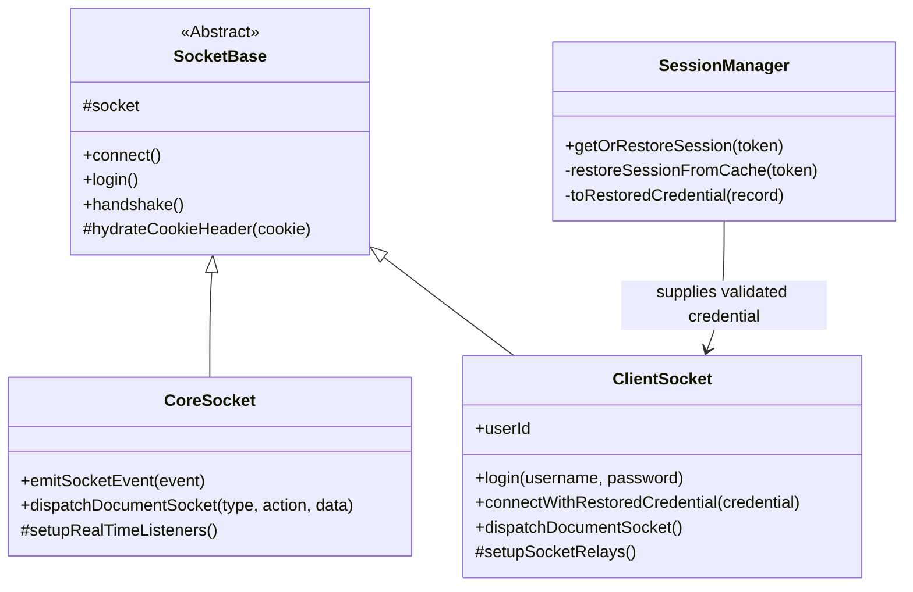

# Foundry V13 Socket Protocol Documentation

This document outlines the socket events and data structures observed for Foundry VTT v13, and details the **SheetDelver Socket Architecture**.

## Architecture Overview

The Socket Architecture uses a hierarchical inheritance model to share connection logic while specializing in data management and presence.

### 1. SocketBase (Abstract)
*   **Role**: Connectivity Hub.
*   **Responsibilities**:
    *   Manages `socket.io` connection lifecycle.
    *   Handles cookie persistence and headers.
    *   Implements high-level `handshake` and `login` workflows.
    *   Hydrates restored browser Cookie headers for transport reconnects; it does not decide whether a cached session is eligible.
*   **Key Files**: `@server/core/foundry/sockets/SocketBase.ts`

### 2. CoreSocket (Backend Singleton)
*   **Role**: System-account transport.
*   **Responsibilities**:
    *   Maintains the service-account socket connection to Foundry.
    *   Emits raw Foundry socket events when a service needs direct wire access.
    *   Dispatches generic document mutations as the service account.
    *   Captures inbound `modifyDocument` events and hands them to the document router/Stores.
    *   Performs raw bootstrap and heartbeat probes requested by world services.
*   **Key Files**: `@server/core/foundry/sockets/CoreSocket.ts`

### 3. ClientSocket (User Presence)
*   **Role**: Authenticated user transport.
*   **Responsibilities**:
    *   Logs a user into Foundry for first-party sessions.
    *   Reconnects with a `RestoredFoundrySessionCredential` that `SessionManager` already validated.
    *   **dispatchDocumentSocket(type, action, data)**: Emits user-scoped `modifyDocument` writes and fails closed if the user socket is unavailable.
    *   Relays user-specific lifecycle and shared-content wire events.
*   **Key Files**: `@server/core/foundry/sockets/ClientSocket.ts`

### 4. SessionManager (Application Session Owner)
*   **Role**: Cached session policy and restore coordinator.
*   **Responsibilities**:
    *   Interprets persistent cached session records.
    *   Validates cached session freshness and active-world identity before a user transport is created.
    *   De-duplicates concurrent restore attempts for the same browser token.
    *   Supplies the narrow `{ userId, cookie }` credential that `ClientSocket` needs to reconnect.
*   **Key Files**: `@server/core/session/SessionManager.ts`

## Socket Operations & Dispatch Model

SheetDelver relies on two primary methods within `CoreSocket` for communicating with the Foundry VTT server:

### 1. `emitSocketEvent` (Low-Level Pipeline)
*   **Purpose**: A direct wrapper around `socket.io`'s standard `.emit()`. Sends raw, named socket events directly to Foundry's socket server and waits for an acknowledgment/callback.
*   **Usage**: Reserved for highly specific, server-level requests that aren't tied to standard data documents.
    *   `getWorldStatus`: Asking if the server is paused/offline.
    *   `world`: Requesting the massive initial burst of game data.
    *   `getCompendiumIndex` / `getDocuments`: Bulk-reading compendium data.

### 2. `dispatchDocumentSocket` (The Document Workhorse)
*   **Purpose**: The primary way SheetDelver interacts with data. Foundry operates entirely around "Documents" (Actors, Items, ChatMessages, etc.). This method packages a request and sends it via the specific `modifyDocument` socket event.
*   **Payload**: `{ type: "DocumentName", action: "CRUD action", operation: { data: [...] } }`
*   **Foundry Backend Flow**:
    1. Receives `modifyDocument`.
    2. Routes to the correct internal class based on `type`.
    3. Checks permissions for the connected Service Account.
    4. Writes changes to the database (LevelDB).
    5. Broadcasts the `modifyDocument` event to all connected clients to keep caches synced.
*   **Examples**:
    *   **Reading Data**: `dispatchDocumentSocket('JournalEntry', 'get', { query: { _id: "ID" } })`
    *   **Writing Data (e.g. updating Health)**: `dispatchDocumentSocket('Actor', 'update', { updates: [{ _id: "ID", name: "New Name" }] })`
    *   **Sending Chat / Rolls**: `dispatchDocumentSocket('ChatMessage', 'create', { data: [chatData] })`

## Core Events (v13 Discovered)

### `session`
*   **Payload**: `{ "sessionId": "...", "userId": "..." }`
*   **Purpose**: Immediate verification of the socket's authentication state.

### `userActivity`
*   **Payload**: `[ "userId", { "active": boolean, "cursor": {x,y}, ... }]`
*   **Relevance**: Primary signal for real-time presence. Broadcasts `active: false` when a user closes their tab.

### `modifyDocument`
*   **Payload**: `{ "type": "User", "action": "update", "result": [...] }`
*   **Usage**: Real-time updates to user roles, avatars, and names. Also broadcasts document creations and updates to keep all clients in sync.

## Real-Time Sync Strategy & Multiplexed Proxy

SheetDelver uses a **Multiplexed Smart Proxy** to ensure data security and environment isolation.

*   **Multiplexed Relay**: Unlike a standard browser client, the Backend Core maintains individual `ClientSocket` connections to Foundry for every authenticated user.
*   **Per-User Isolation**: World-backed realtime events are re-emitted only after the server checks the requesting user's visibility. The browser receives application events from `AppSocketGateway`, not raw Foundry broadcasts.
*   **System Status**: The singleton `CoreSocket` remains the master source for global, non-sensitive world metadata (world title, status, active user counts).
*   **Primary Document Cache**: To optimize performance, `SystemService.bootstrap()` seeds primary document stores after module discovery. Route clients and Foundry event ingress feed modify-document results into those stores instead of owning separate document state.
*   **Document Realtime**: Primary document stores emit typed changed/list-invalidated events. `AppSocketGateway` forwards those as application socket events such as `<type>Changed` and `<type>ListInvalidated`; module UI consumes the SDK signal bus (`document:changed` / `document:listInvalidated`) rather than raw socket events.

## Limitations & Future Considerations

While the current socket implementation is functional, there are several areas of concern and potential improvements for the future:

1.  **Strict Permission Assumptions**: `dispatchDocumentSocket` assumes the headless Service Account has Game Master (or Assistant GM) permissions. If the account is demoted to a standard "Player", operations like fetching all users, reading private GM compendiums, or updating other players' actors will silently fail or return errors.
2.  **Primary Document Coverage**: `ActorStore` handles Actor, Item, and ActiveEffect mutations for actor-owned embedded data. Other primary document types (`Item`, `Cards`, `ChatMessage`, `Combat`, etc.) still need their own stores and bootstrap seeding before they can use the same cache-backed read model.
3.  **Macro Execution**: There is currently no native way to explicitly execute a macro (e.g., "Execute Macro X") over the socket. To achieve macro-like effects, the headless client must mimic the exact document updates the macro *would* perform.
4.  **Local Roll Evaluation**: `CoreSocket.roll()` evaluates dice math *locally* in the Node.js environment using a replica `Roll` class, and then sends the resulting totals/strings to Foundry as a `ChatMessage`. The server backend is not asked to roll the dice. While this matches standard browser behavior, it means complex Foundry modules that hook deeply into the server's internal rolling sequence might not trigger.
