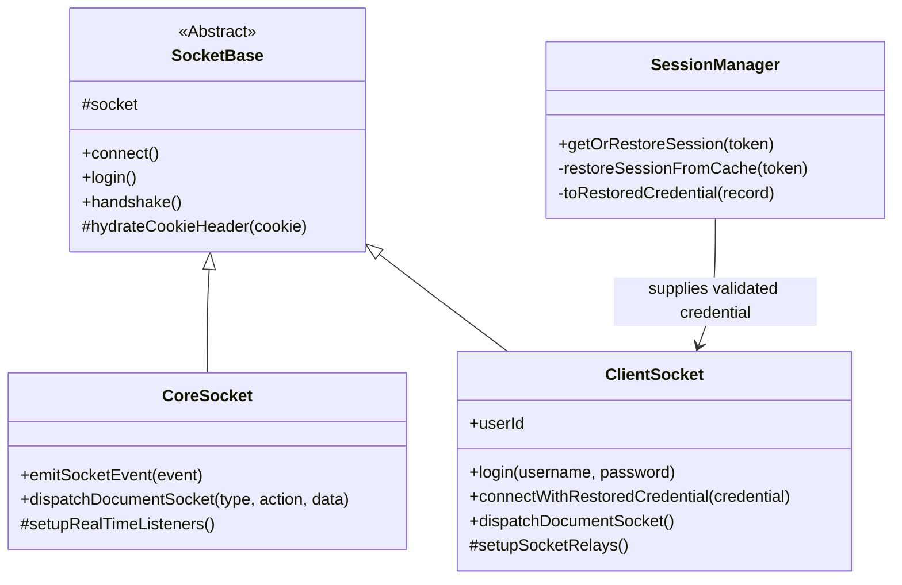

# Foundry V13-V14 Socket Protocol and Transport Architecture

This document describes the Foundry socket and login contracts supported by
SheetDelver for Foundry VTT generations 13 and 14. Generation 13 remains fully
supported, and generation 14 support is not capped to a particular maintenance
build.

## Architecture Overview

The Socket Architecture uses a hierarchical inheritance model to share connection logic while specializing in data management and presence.

### 1. SocketBase (Abstract)
*   **Role**: Connectivity Hub.
*   **Responsibilities**:
    *   Manages `socket.io` connection lifecycle.
    *   Handles cookie persistence and headers.
    *   Reads the Foundry version during `/api/status` handshake and selects the
        matching `/join` login payload.
    *   Hydrates restored browser Cookie headers for transport reconnects; it does not decide whether a cached session is eligible.
*   **Key Files**: `@server/core/foundry/sockets/SocketBase.ts`

### 2. CoreSocket (Backend Singleton)
*   **Role**: System-account transport.
*   **Responsibilities**:
    *   Maintains the service-account socket connection to Foundry.
    *   Emits raw Foundry socket events when a service needs direct wire access.
    *   Dispatches generic document mutations as the service account.
    *   Captures inbound `modifyDocument` events and hands them to the document router/Stores.
    *   Performs raw bootstrap and heartbeat probes requested by world services.
*   **Key Files**: `@server/core/foundry/sockets/CoreSocket.ts`

### 3. ClientSocket (User Presence)
*   **Role**: Authenticated user transport.
*   **Responsibilities**:
    *   Logs a user into Foundry for first-party sessions.
    *   Reconnects with a `RestoredFoundrySessionCredential` that `SessionManager` already validated.
    *   **dispatchDocumentSocket(type, action, data)**: Emits user-scoped `modifyDocument` writes and fails closed if the user socket is unavailable.
    *   Relays user-specific lifecycle and shared-content wire events.
*   **Key Files**: `@server/core/foundry/sockets/ClientSocket.ts`

### 4. SessionManager (Application Session Owner)
*   **Role**: Cached session policy and restore coordinator.
*   **Responsibilities**:
    *   Interprets persistent cached session records.
    *   Validates cached session freshness and active-world identity before a user transport is created.
    *   De-duplicates concurrent restore attempts for the same browser token.
    *   Supplies the narrow `{ userId, cookie }` credential that `ClientSocket` needs to reconnect.
*   **Key Files**: `@server/core/session/SessionManager.ts`

## Supported Versions and Login Negotiation

The public SheetDelver login request remains
`POST /api/login { username, password }` for every supported Foundry version.
Core resolves that display name to a Foundry user id, then `SocketBase` uses
the version returned by Foundry's `GET /api/status` response to construct the
upstream `POST /join` request.

| Foundry version | Upstream identity fields |
| --- | --- |
| Generation 13 | `userid: <resolved-id>` |
| Generation 14 through build 365 | `userid: <resolved-id>` |
| Generation 14 build 366 and later | `username: <configured-name>`, `userId: <resolved-id>` |

Both `CoreSocket` service-account login and `ClientSocket` user login use this
shared negotiation. The v13 lowercase `userid` contract is intentionally
retained. Build 367 is recorded as the configured environment that verified the
build 366+ login branch, not as the maximum supported generation 14 build. A
restored user session bypasses `/join`: `SessionManager` validates the
encrypted record and gives `ClientSocket` only the prior `{ userId, cookie }`
transport credential.

Generations below 13 fail bootstrap. Generations 13 and 14 are supported.
Generation 15 and later currently warn as `newer-untested` and proceed under
the compatibility policy rather than being claimed as supported.

## Socket Operations & Dispatch Model

SheetDelver uses the same Foundry wire operations through two identity-bound
transports. `CoreSocket` is the service-account transport for platform
bootstrap, metadata, compendium hydration, and explicit system operations.
`ClientSocket` is the requesting user's transport for user-originated document
reads and writes. A missing user socket fails closed; it never falls back to
`CoreSocket`.

### 1. `emitSocketEvent` (Low-Level Pipeline)
*   **Purpose**: A direct wrapper around `socket.io`'s standard `.emit()`. Sends raw, named socket events directly to Foundry's socket server and waits for an acknowledgment/callback.
*   **Usage**: Reserved for highly specific, server-level requests that aren't tied to standard data documents.
    *   `getWorldStatus`: Asking if the server is paused/offline.
    *   `world`: Requesting the massive initial burst of game data.
    *   `getCompendiumIndex` / `getDocuments`: Bulk-reading compendium data.

### 2. `dispatchDocumentSocket` (The Document Workhorse)
*   **Purpose**: Packages Foundry document requests as `modifyDocument` socket
    events. The method exists on both identity-bound transports; selecting the
    transport is an authorization decision made before dispatch.
*   **Payload**: `{ type: "DocumentName", action: "CRUD action", operation: { data: [...] } }`
*   **Foundry Backend Flow**:
    1. Receives `modifyDocument`.
    2. Routes to the correct internal class based on `type`.
    3. Checks permissions for the user connected on that specific transport.
    4. Writes changes to the database (LevelDB).
    5. Broadcasts the `modifyDocument` event to all connected clients to keep caches synced.
*   **Examples**:
    *   Platform bootstrap and explicitly system-owned reads may use the service
        account after Core has established that identity.
    *   Player actor updates, document creation/deletion, chat, and rolls use the
        authenticated player's `ClientSocket`, so Foundry applies that player's
        role and document permissions.

## Core Events (Observed in V13 and Exercised in V14)

### `session`
*   **Payload**: `{ "sessionId": "...", "userId": "..." }`
*   **Purpose**: Immediate verification of the socket's authentication state.

### `userActivity`
*   **Payload**: `[ "userId", { "active": boolean, "cursor": {x,y}, ... }]`
*   **Relevance**: Primary signal for real-time presence. Broadcasts `active: false` when a user closes their tab.

### `modifyDocument`
*   **Payload**: `{ "type": "User", "action": "update", "result": [...] }`
*   **Usage**: Real-time updates to user roles, avatars, and names. Also broadcasts document creations and updates to keep all clients in sync.

## Real-Time Sync Strategy & Multiplexed Proxy

SheetDelver uses a **Multiplexed Smart Proxy** to ensure data security and environment isolation.

*   **Multiplexed Relay**: Unlike a standard browser client, the Backend Core maintains individual `ClientSocket` connections to Foundry for every authenticated user.
*   **Per-User Isolation**: World-backed realtime events are re-emitted only after the server checks the requesting user's visibility. The browser receives application events from `AppSocketGateway`, not raw Foundry broadcasts.
*   **System Status**: The singleton `CoreSocket` remains the source for global
    world availability. Status projection decides which allowlisted
    presentation fields can reach pre-authentication clients.
*   **Primary Document Cache**: To optimize performance, `SystemService.bootstrap()` seeds primary document stores after module discovery. Route clients and Foundry event ingress feed modify-document results into those stores instead of owning separate document state.
*   **Document Realtime**: Primary document stores emit typed changed/list-invalidated events. `AppSocketGateway` forwards those as application socket events such as `<type>Changed` and `<type>ListInvalidated`; module UI consumes the SDK signal bus (`document:changed` / `document:listInvalidated`) rather than raw socket events.

## Limitations & Future Considerations

While the current socket implementation is functional, there are several areas of concern and potential improvements for the future:

1.  **Service-account scope**: The configured service account must exist in each
    active world and needs enough permission for platform bootstrap, metadata,
    and configured system operations. This authority is not borrowed for a
    player's failed request.
2.  **Newer Foundry generations**: Generation 15 and later are allowed under a
    warning so operators can diagnose shape drift, but they are not currently
    in the supported range.
3.  **Macro execution**: There is no generic protocol for executing arbitrary
    Foundry macros. A module composes the supported document, roll, table, and
    chat primitives instead.
4.  **Local roll evaluation**: SheetDelver's bounded local `Roll`
    implementation evaluates supported formulas before a service posts the
    structured result to Foundry. Foundry modules that depend on deeper internal
    roll hooks may therefore require a module-specific integration.
